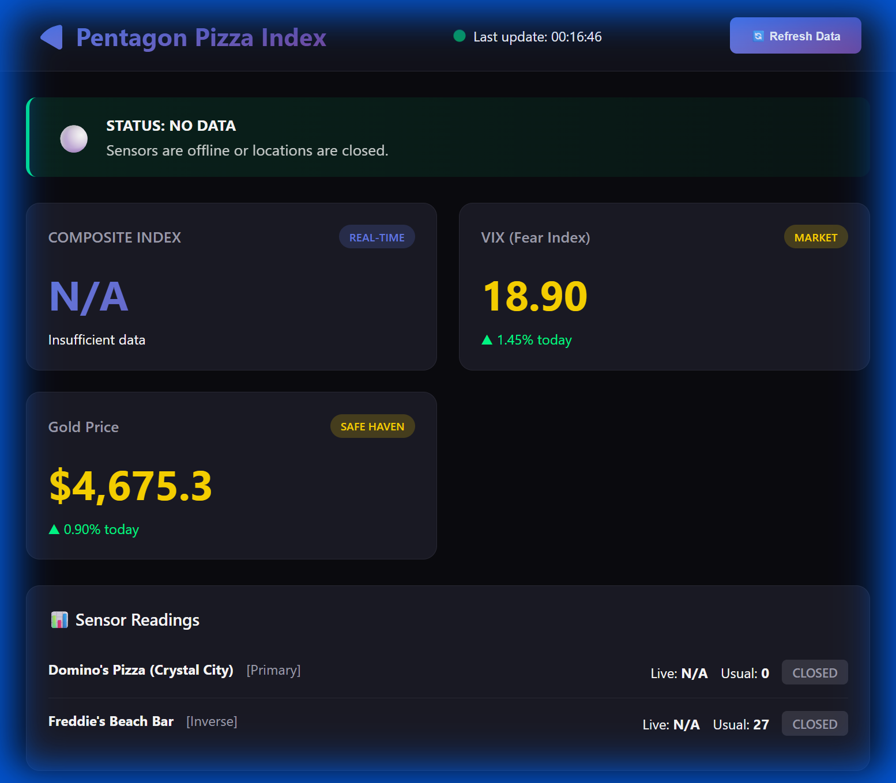

# 🍕 Pentagon Pizza Index

**Real-Time OSINT Analysis Dashboard for Alternative Data Signals**



## The Theory

Unusual spikes in food delivery orders (specifically pizza) near government defense hubs (The Pentagon) during non-standard hours may indicate high-intensity operational activity (e.g., geopolitical crises).

This "Alternative Data" signal may precede volatility in Safe Haven Assets (Gold, US Treasuries) or the VIX index.

## ✨ Features

- **Real-time Dashboard** - Beautiful dark-themed web interface with live data
- **Market Integration** - VIX and Gold price tracking via Yahoo Finance
- **Sensor Network** - Multiple location monitoring near the Pentagon
- **Interactive Charts** - Plotly-powered visualizations with weekly heatmaps
- **Anomaly Detection** - Composite index with color-coded alert levels
- **Standalone EXE** - Double-click to run, no Python required

## 🚀 Quick Start

### Option 1: Run the EXE (Easiest)
```
dist/PentagonPizzaIndex.exe
```
Double-click the EXE and the dashboard will open in your browser automatically!

### Option 2: Run from Python
```bash
# Install dependencies
python src/setup_env.py

# Run the dashboard
python src/dashboard.py
```

Open http://localhost:5000 in your browser.

## 📊 Dashboard Overview

```
┌────────────────────────────────────────────────────────────────────┐
│  🍕 Pentagon Pizza Index                      🔄 Refresh Data      │
├────────────────────────────────────────────────────────────────────┤
│                                                                    │
│  🟢 STATUS: NORMAL                                                 │
│  Activity within expected range. No anomalies detected.           │
│                                                                    │
├─────────────────┬─────────────────┬────────────────────────────────┤
│ COMPOSITE INDEX │ VIX (Fear Index)│ Gold Price                     │
│ +5.2%           │ 18.90 🟢        │ $4,675.30                      │
│ Normal          │ ▲ 1.45% today   │ ▲ 0.90% today                  │
├─────────────────┴─────────────────┴────────────────────────────────┤
│  📊 Sensor Readings                                                │
│  ─────────────────────────────────────────────────────────────     │
│  Domino's Pizza (Crystal City)  [PRIMARY]   Live: 45 | Usual: 30  │
│  Freddie's Beach Bar            [INVERSE]   Live: 20 | Usual: 55  │
├────────────────────────────────────────────────────────────────────┤
│  📈 Weekly Popularity Heatmap                                      │
│  [Interactive Plotly Chart - 7 days x 24 hours]                   │
├────────────────────────────────────────────────────────────────────┤
│  VIX 5-Day Trend          │  Gold 5-Day Trend                     │
│  [Line Chart]             │  [Line Chart]                          │
└────────────────────────────────────────────────────────────────────┘
```

## 🎯 Alert Levels

| Score | Status | Color | Interpretation |
|-------|--------|-------|----------------|
| > +50% | 🔴 RED ALERT | Red | Unusual activity - possible crisis |
| > +25% | 🟠 ELEVATED | Orange | Above-normal - monitor closely |
| > +10% | 🟡 WATCH | Yellow | Slightly elevated |
| ±10% | 🟢 NORMAL | Green | Expected range |
| < -25% | 🔵 QUIET | Blue | Below-normal activity |

## 📁 Project Structure

```
The-Pizza-Meter/
├── dist/
│   └── PentagonPizzaIndex.exe    # 🎯 Standalone executable
├── src/
│   ├── setup_env.py              # Dependency installer
│   ├── find_places.py            # Google Place ID discovery
│   ├── test_scraper.py           # CLI analysis report
│   ├── dashboard.py              # 🌐 Web dashboard (Flask + Plotly)
│   ├── launcher.py               # Simple EXE launcher
│   └── build_exe.py              # PyInstaller build script
├── discovered_places.json        # Cached Place IDs
├── latest_reading.json           # Most recent sensor data
└── README.md                     # This file
```

## 🛰️ Sensor Network

| Sensor | Type | Role | Address |
|--------|------|------|---------|
| Domino's Pizza | 🍕 Pizza | Primary | Crystal City, Arlington VA |
| Freddie's Beach Bar | 🍺 Bar | Inverse | Crystal City, Arlington VA |
| Papa John's Pizza | 🍕 Pizza | Secondary | Columbia Pike (needs setup) |

**Inverse Indicator**: When the bar is unusually empty (low busyness), it suggests people are working late nearby - a bullish signal for the Pizza Index.

## 🔧 Building the EXE

To rebuild the standalone executable:

```bash
python -m PyInstaller --onefile --name="PentagonPizzaIndex" --console src/dashboard.py
```

The EXE will be created in the `dist/` folder.

## ⚠️ Limitations

1. **Live Data Hours**: Google only provides `current_popularity` during business hours when enough visitors are present. Late-night readings show `null`.

2. **Rate Limiting**: Google may throttle requests. The dashboard auto-refreshes every 5 minutes.

3. **Time Zone**: Sensors are in EST (Arlington, VA). Adjust analysis accordingly.

## 📈 Data Sources

- **Alternative Data**: Google Maps (via `livepopulartimes`)
- **Market Data**: Yahoo Finance (via `yfinance`)
  - VIX: CBOE Volatility Index
  - Gold: Gold Futures (GC=F)

## 🛣️ Roadmap

- [ ] Historical data logging to SQLite
- [ ] Email/SMS alerts for anomaly spikes
- [ ] More pizza sensors (Pizza Hut, local shops)
- [ ] Correlation analysis with market data
- [ ] Selenium fallback for anti-scraping

## ⚖️ Disclaimer

This project is for **educational and research purposes only**. It does not constitute financial advice. The "Pentagon Pizza Index" is a theoretical concept for exploring alternative data analysis.

---

**Built with ❤️ and 🍕**
